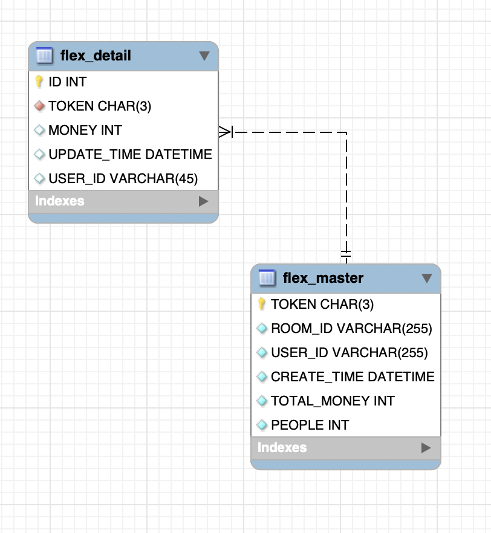

# KAKAOPAY FLEX API
카카오페이가 제공하는 머니 뿌리기 기능의 간소화된 REST API 구현


## 요구 사항
 1. 뿌리기, 받기, 조회 기능을 수행하는 REST API 를 구현합니다.
 2. 요청한 사용자의 식별값은 숫자 형태이며 "X-USER-ID" 라는 HTTP Header로
전달됩니다.
 3. 요청한 사용자가 속한 대화방의 식별값은 문자 형태이며 "X-ROOM-ID" 라는
HTTP Header로 전달됩니다.
 4. 모든 사용자는 뿌리기에 충분한 잔액을 보유하고 있다고 가정하여 별도로
잔액에 관련된 체크는 하지 않습니다.
 5. 작성하신 어플리케이션이 다수의 서버에 다수의 인스턴스로 동작하더라도 기능에
문제가 없도록 설계되어야 합니다.
 6. 각 기능 및 제약사항에 대한 단위테스트를 반드시 작성합니다.

## 진행 과정
1. 데이터 모델링
   * 전달받은 문서 내 요구 사항을 분석하여 아래와 같이 테이블 모델링을 진행 함
   * ERD
      
      
   
2. API 기능 명세
   * URL 설계 
   * 요청 데이터 및 응답 데이터 규격 정의
3. 구현 및 테스트
   * 유닛 테스트와 함께 세부 구현 작업 진행

## API 
### 1. 뿌리기 API
기능: 뿌릴 금액과 뿌릴 인원을 요청값으로 받아 대화방 참여자에 뿌립니다.

Request 
  * URI: /kakaopay/payFlex
  * Http Method: POST
  * Headers: 
      * X-USER-ID: 뿌리는 사용자 아이디
      * X-ROOM-ID: 뿌릴 대화방 아이디
  * Body: 
      * money: 뿌리는 총 금액
      * people: 뿌릴 인원 수
```
{
  "money": 1000,
  "people": 3 
}
```

Response
  * 결과코드와 뿌리기 건에 해당하는 고유 토큰 문자열을 반환합니다.
```
{
  "token": "sGX",
  "code": "200",
  "cont": "정상 처리",
  "money": 0,
  "history": null
}
```


### 2. 받기 API
기능: 참여한 대화방에 뿌려진 돈을 받습니다.

Request 
  * URI: /kakaopay/payFlex/{token}
  * Http Method: POST
  * Headers: 
      * X-USER-ID: 뿌리는 사용자 아이디
      * X-ROOM-ID: 뿌릴 대화방 아이디  
  * path: 
      * token: 발급된 token 값
  
  
Response
  * 결과코드와 받은 돈의 액수를 전달합니다. 
```
{
  "token": "sGX",
  "code": "200",
  "cont": "정상 처리",
  "money": 302,
  "history": null
}
```

### 3. 조회 API
기능 : 뿌리기를 요청한 사람이 내역을 조회하는 기능.
Request 
  * URI: /kakaopay/payFlex/{token}
  * Http Method: GET
  * Headers: 
      * X-USER-ID: 뿌리는 사용자 아이디
      * X-ROOM-ID: 뿌릴 대화방 아이디
  * path: 
      * token: 발급된 token 값
      
Response
  * 토큰에 해당하는 뿌리기 건의 현재 상태를 응답값으로 내려줍니다.
     * 뿌린 시각, 뿌린 금액, 받기 완료된 금액
     * 받기 완료된 정보의 배열 ([받은 금액, 받은 사용자 아이디] 리스트)
  * 샘플 응답
```
{
  "token": null,
  "code": "200",
  "cont": "정상 처리",
  "money": 0,
  "history": {
    "createTime": "2020-10-10T12:40:41",
    "totalMoney": 1000,
    "takeMoney": 302,
    "details": [
      {
        "id": 25,
        "token": "sGX",
        "updateTime": "2020-10-10T12:45:43",
        "money": 302,
        "userId": "tes2"
      }
    ]
  }
}
```

### 4. 공통 에러 응답
Response
  * 결과코드와 에러 메시지를 반환합니다. 해당값들은 enum클래스에서 관리합니다.
  * 샘플 응답
```
{
    "code": "200",
  "cont": "정상 처리",
}
```


## 빌드 및 실행 방법
1. 원하는 경로에서 소스코드를 다운로드합니다.
```
https://github.com/wonsubshin/kakaopayFlex.git
```
2. 다운로드 폴더의 하위 경로로 이동하여 실행 파일을 생성합니다.
```
cd flex
mvn install
```
3. 위의 단계까지 마치면 target 폴더에 실행가능한 war 생성됩니다. 이 파일을 이용하여 톰캣에 올려애플리케이션을 구동합니다.
   자체적으로 swagger-ui를 탑재하여 테스트가 원할하도록 하였습니다
```
톰캣 구동후 

1.postman등 api 테스트 유틸 이용시
http://localhost:8080/flex/{상기api 호출}

2.swagger-ui 이용시
http://localhost:8080/flex/swagger-ui.html
```

